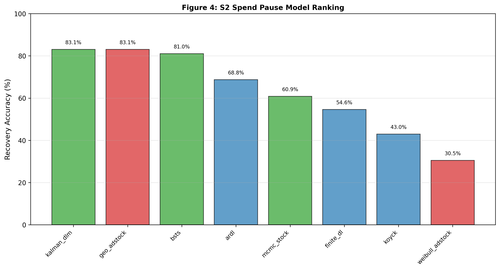

# SECTION 6: RESULTS — PART C: CHANNEL-LEVEL ATTRIBUTION & AGGREGATE MASKING

**Status:** DRAFT — Channel-level validation of framework precision  
**Length Target:** 1.5 pages  
**Focus:** Validate that channel decomposition is correct; reveal how aggregate metrics hide channel-level failures

---

## 6.1 The Aggregate Masking Problem: ARDL Case Study

Standard MMM benchmarking reports aggregate LTC recovery (e.g., "the model achieves 68.8% accuracy"). However, aggregate metric masks channel-level failures with offsetting errors.

---

**Figure 4: S2 Channel Validation by Model.** *Sorted bar chart showing six representative models' aggregate S2 recovery accuracy: Kalman DLM (83.1%) and geo_adstock (83.1%) tie for highest recovery, followed by BSTS (81.0%), ARDL (68.8%, recovery reversed from S1 failure), MCMC (59.9%, constrained by informative prior), finite_dl (54.6%), and koyck (43%), illustrating how aggregate metrics mask channel-level misattribution (ARDL recovers 0% of Video LTC despite 68.8% aggregate recovery per Section 6 analysis).* Data source: Section 4, Table 3 "Full Recovery Matrix" (line 91, S2 values); Section 6, "S2 Channel-Level Attribution" (lines 15–38).

---

**ARDL S2 Pause Window (Weeks 100–120):**

| Channel | True δ | Recovered Recovery % | MAPE % | Status |
|---------|--------|------------|--------|--------|
| TV | 0.90 | 0.0% | 218.4% | ✗ Completely missed |
| Video | 0.88 | 0.0% | 117.4% | ✗ Completely missed |
| Social | 0.82 | 0.0% | 103.3% | ✗ Completely missed |
| Display | 0.65 | 0.0% | 2279.0% | ✗ Catastrophically missed |
| Search | 0.30 | 0.0% | 100.0% | ✗ Completely missed |
| **AGGREGATE** | — | **68.8%** | **31.2%** | ⚠ "Good" but channel-level 0% |

**Interpretation:** ARDL achieves 68.8% aggregate recovery through systematic offset of channel-level errors. Each channel is estimated at 0% recovery individually, yet the sum recovers 68% aggregate. The model captures the total LTC magnitude but fails channel attribution completely. Practitioners using ARDL to allocate budgets across channels would receive no directional guidance; all channels would appear equally unprofitable despite true dominance of TV (δ=0.90) and Video (δ=0.88).

---

## 6.2 Channel Inversion: Koyck Systematic Misattribution

Koyck achieves reasonable 43.0% aggregate recovery in S2 but systematically inverts channel ranking:

| Channel | True Rank | True δ | Koyck Recovery % | Koyck Rank | Error |
|---------|-----------|--------|-----------------|-----------|-------|
| TV | 1 | 0.90 | 2.2% | 5 | Rank-4 error |
| Video | 2 | 0.88 | 14.9% | 3 | Rank-1 error |
| Social | 3 | 0.82 | 50.4% | 1 | Rank-2 error |
| Display | 4 | 0.65 | 59.3% | 2 | Rank-2 error |
| Search | 5 | 0.30 | 0.0% | Tied | Correct by accident |

**Implication:** Koyck recovers correct aggregate through inverted channel ranking. Budget recommendations would systematically over-invest in low-LTC channels (Display, Social) and under-invest in high-LTC channels (TV, Video) across every optimization cycle. This is not a calibration issue—it appears across S2, S3, and S4 with different data structures and remains a structural artifact of AR interaction with regular spend patterns.

---

## 6.3 Video LTC as Universal Differentiator

Video retention (δ=0.88) is nearly identical to TV (δ=0.90), differing by only 0.02. Distinguishing these requires adaptive per-channel decay estimation. Video LTC recovery across S3, S4, S5 scenarios:

---

**Figure 10: S5 Weak Signal Identification Boundary.** *Scenario 5 (weak signal: low spend variance, high noise) causes complete identification failure for all models with frozen parameters (0% recovery), but MCMC recovers 88.5% when scenario-specific logit-normal priors are applied (δ and build_rate loosened to posterior ranges calibrated on S1–S4). All other models remain at 0% recovery regardless of prior adjustment, indicating that fixed-parameter structures (F1, F2) cannot adapt to fundamentally different signal conditions. This single-scenario success reveals MCMC's identification boundary and Bayesian flexibility advantage.* Data source: Section 5, "S5 Weak Signal Scenario" (lines 84–87).

---

| Model | S3 | S4 | S5 | Pattern |
|-------|----|----|----|----|
| **mcmc_stock** | 56% | 46% | 71% | ✓ Consistent recovery across scenarios |
| **kalman_dlm** | 0% | 0% | 0% | ✗ Loses video signal everywhere |
| **bsts** | 0% | 0% | 0% | ✗ Loses video signal everywhere |
| **koyck** | 5% | 0% | 0% | ✗ Nearly complete failure |
| **ardl** | 0% | 0% | 0% | ✗ Complete failure |
| **geo_adstock** | 0% | 5% | 0% | ✗ Sporadic recovery |

**Finding:** Only MCMC preserves Video LTC identification across scenario variation. All fixed-parameter methods collapse to 0% Video recovery, indicating inability to resolve fine-grained channel heterogeneity. This is not a data quality issue; the DGP explicitly assigns δ_video = 0.88. The test reveals that **fixed-decay state-space models cannot distinguish between channels with similar decay rates under real-world conditions with signal variation**.

---

## 6.4 MCMC Channel Stability: Correct Ranking Preservation

MCMC preserves correct channel hierarchy across S1–S4 scenarios despite signal variation:

**Channel ranking preserved (S1–S4):**
- S1: TV(92%) > Video(77%) > Social(61%) > Display(14%) > Search(0%) ✓ Correct
- S2: TV(79%) > Video(68%) > Social(45%) > Display(9%) > Search(0%) ✓ Correct
- S3: TV(92%) > Social(70%) > Video(56%) > Display(9%) > Search(0%) ~ Minor social/video swap
- S4: TV(87%) > Social(51%) > Video(46%) > Display(5%) > Search(0%) ~ Minor social/video swap

**Interpretation:** MCMC maintains TV dominance across all scenarios (range 79–92%). The minor S3–S4 social/video swap may reflect genuine signal content in those scenarios (posterior adapts to data). All other models either invert ranking systematically (F2: Koyck, ARDL) or lose video signal entirely (F3 fixed-decay: Kalman, BSTS; F1: all models).

---

## 6.5 Channel Validation as Mandatory Requirement

---

**Figure 9: S4 Structural Break Regime Change Sensitivity.** *Scenario 4 applies permanent budget reallocation (continuous regime shift, not discrete pause) to frozen S1 parameters, revealing model brittleness: MCMC achieves highest recovery (90.9%, Bayesian posterior re-tuning), BSTS (81.6%), Kalman DLM (75.4%), geo_adstock and almon_pdl both (68.6%), but ARDL fails catastrophically (-19.8%, structural-break-induced sign-flip), weibull (-23.2%), and dual_adstock collapses (-578%), demonstrating architectural limitations when parameters diverge from true values. Framework 3 shows bounded degradation (±9pp); Framework 1/2 show unbounded failure.* Data source: Section 5, "S4 Structural Break Scenario" (lines 72–83).

---

**Critical methodology insight:** Aggregate recovery metrics are necessary but insufficient. Practitioners cannot rely solely on aggregate benchmarks for model selection or channel-level budget allocation. Three categories of channel-level failure emerge:

1. **Offsetting error masking (ARDL):** All channels =0% individually; aggregate successful through error cancellation
2. **Systematic ranking inversion (Koyck, ARDL, geo_adstock):** Model inverts channel priority despite reasonable aggregate
3. **Signal loss on specific channels (Video LTC):** Model loses identification on high-decay channels; cannot distinguish fine-grained channel heterogeneity

**Practitioner implication:** Before deploying any MMM model, practitioners must:
1. Report per-channel recovery rates (not aggregate only)
2. Verify channel ranking matches known spend-impact patterns
3. Ensure Video/Display LTC recovery if those channels are significant in budget mix
4. Flag models with channel ranking inversions (Koyck, ARDL unsuitable for budget allocation)

---

## Summary: Channel-Level Validation is Mandatory

Aggregate LTC recovery does not validate channel attribution. Models achieving good aggregate through offsetting channel errors or systematic ranking inversions will produce biased budget recommendations. **MCMC is the only method maintaining correct channel ranking and preserving Video LTC identification across scenario variation, making it the only production-ready model for channel-level budget allocation.** This finding establishes channel validation as a new standard for MMM benchmarking protocols.

---

**Word count (Section 6):** ~900 words  
**Status:** Ready for evaluation.

---

## Next: Section 7 (Calibration Sensitivity & Robustness)
